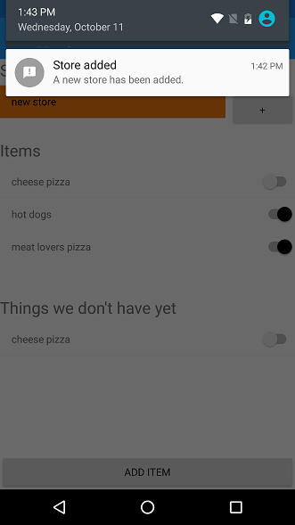

# RealmShoppingListDemo
Demo app that shows how you can use Realm Mobile DB and the Realm Mobile Platform to build a small shopping list app

## Advanced Realm Mobile DB
This demo shows how we can easily use the Realm Mobile DB for local data storage, showing things like "Live Objects" (ThingsWeDontHaveYet list), Encryption (configuration) and Notifications.

