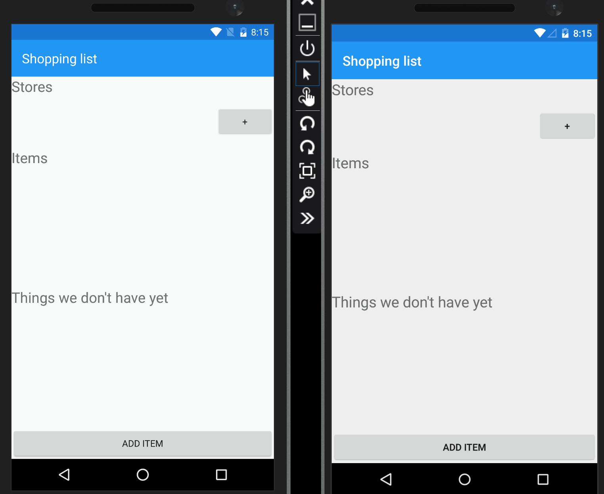

# RealmShoppingListDemo
Demo app that shows how you can use Realm Mobile DB and the Realm Mobile Platform to build a small shopping list app

## Real-time sync 
This demo shows how we can easily use the Realm Mobile Platform for Real-time data synchronisation. A Realm Object Server is installed and configured on a Azure VM. Both phones run the same app that connect to this object server.

